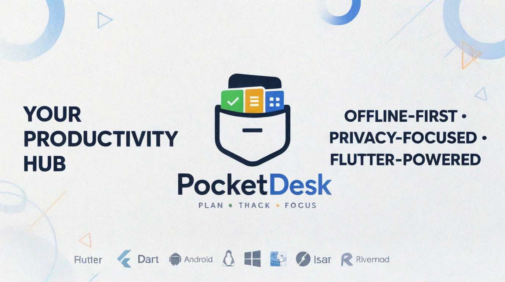
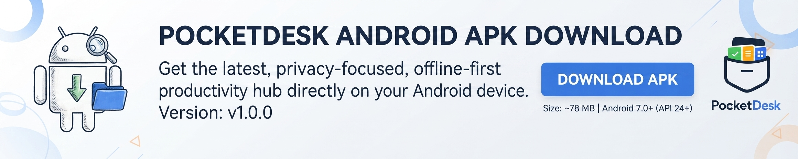
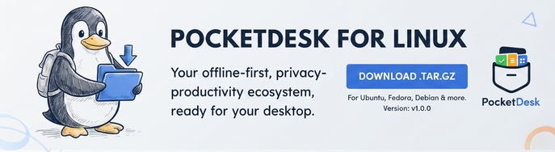

<div align="center">



# PocketDesk

**Your offline-first, privacy-respecting productivity ecosystem.**

*Plan • Track • Focus*

<br>

[](https://flutter.dev)
[](https://dart.dev)
[](https://developer.android.com)
[](https://flutter.dev/desktop)
[](LICENSE)
[](https://github.com/Aaryanbanskota/Pocket-Desk/releases)
[](https://github.com/Aaryanbanskota/Pocket-Desk/stargazers)

<br>

[📥 Android](#-android-downloads) ·
[🐧 Linux](#-linux-desktop-downloads) ·
[✨ Features](#-features) ·
[🏗 Architecture](#-architecture) ·
[🚀 Quick Start](#-quick-start-development) ·
[🤝 Contributing](#-contributing)

</div>

---

## 📖 About

**PocketDesk** is a production-quality, offline-first productivity hub built with Flutter.  
It combines a full-featured **Calendar**, **Task Manager**, **Notes** app, and **Schedule Planner** into a single, beautifully designed application — without requiring a cloud account or internet connection.

> **You own your data. Everything works offline. Internet is only used for device-to-device synchronization.**

### Platform Support

| Platform | Status |
|:---------|:-------|
|  **Android** (API 24+) | ✅ Supported |
|  **Linux / Ubuntu** | ✅ Supported |
|  **Windows** | 🔜 Planned |
|  **macOS** | 🔜 Planned |

---

## ⚡ Recent Updates & Fixes (v1.2.0)

- 🤖 **Universal AI Integration & Security**:
  - Implemented direct Isar database querying (`AISettingsRepository`) for AI features across all screens (Money Health, Note Editor, Chat Buddy, Personal Feed), eliminating transient state issues.
  - Added **Argon2id Password Lock** in Settings to protect saved AI API keys; users must authenticate with their login password before viewing, editing, or deleting API keys.
- 💬 **AI Buddy Companion**: Offline/P2P chat falls back to PocketDesk AI ("yo {username}") when no peer is connected.
- 💰 **Money Tracker & Money Health Page**: Added full expense management (Wallet balance, expense breakdown by category, currency selector) and AI Spending Analysis with Spending Score (0–100).
- 📲 **Offline Personal Social Feed**: Added local feed with post creation, media attachments, and automatic AI interactions/comments.
- 📝 **Rich Note Checklist & Formatting**: Auto-save, archive, trash/restore, duplicate notes, checklist formatting, audio/drawings/attachments support.
- 🎯 **Task & Event Previews & Navigation**: Modernized task preview modal, edit sheet, deletion icon, and hamburger navigation drawer across all main pages.
- 🛠 **FVM Flutter SDK Pinning & Linux Desktop Build**: Pinned Flutter `3.24.0` via FVM to maintain build stability and compatibility across environments.

---

## 📥 Downloads & Releases

### 🤖 Android Downloads

<div align="center">
  
</div>

| Build Type | Download | Size |
|:-----------|:---------|:-----|
| **Release APK** | [📥 Download APK](https://github.com/Aaryanbanskota/Pocket-Desk/raw/main/all-apk/app-release.apk) | ~78 MB |
| **App Bundle (AAB)** | [📦 Download AAB](https://github.com/Aaryanbanskota/Pocket-Desk/raw/main/all-apk/app-release.apk)) | ~36 MB |

> **Tip:** Prefer the AAB for Google Play / modern installers. Use the APK for sideloading.

### 🐧 Linux Desktop Downloads

<div align="center">
  
</div>

| Platform | Download | Size |
|:---------|:---------|:-----|
| **Linux x64** | [🐧 Download tar.gz](https://github.com/Aaryanbanskota/Pocket-Desk/blob/main/pocketdesk-linux-x64.tar.gz) | ~15 MB |

#### Linux Installation

```bash
# 1. Download & extract
tar -xzf pocketdesk-linux-x64.tar.gz
cd bundle

# 2. Install system dependencies
# Ubuntu / Debian
sudo apt-get update && sudo apt-get install -y \
  clang cmake ninja-build pkg-config libgtk-3-dev libsecret-1-dev

# Fedora
sudo dnf install clang cmake ninja-build pkgconfig gtk3-devel libsecret-devel

# 3. Run
./pocketdesk
```

---

## ✨ Features

<table>
<tr>
<td width="50%" valign="top">

### 📅 Calendar & Events
- Day / Week / Month / Year / Agenda views
- Recurring events (full RFC 5545 support)
- Event Previews & Quick Edit / Delete
- Multiple color-coded calendars & reminders
- ICS Import & Export, fully offline

</td>
<td width="50%" valign="top">

### ✅ Task Manager
- Task Preview modal & compact edit sheet
- Subtask checklists & progress tracking
- Priority levels (Urgent → Low)
- Quick edit/delete icons on dashboard
- Swipe actions & Archive history

</td>
</tr>
<tr>
<td width="50%" valign="top">

### 📝 Note Ecosystem
- Markdown & Rich Text Editor + AI Auto-format
- Core checklist (Title, Content, Tags, Pin, Star, Archive, Trash, Duplicate)
- Formatting: Headings, checklists, code blocks, lists
- Attachments: Images, files/PDFs, audio notes, drawings
- Organization: Folders, colors, tag/title search

</td>
<td width="50%" valign="top">

### 💰 Money Health & Wallet
- Starting & current wallet balance tracker
- Expense recording with categories & dates
- Complete spending history & category filters
- **AI Spending Score (0–100)** with personalized financial advice

</td>
</tr>
<tr>
<td width="50%" valign="top">

### 🤖 Smart AI Integration
- Companion Chatbot (`"yo {username}"`)
- Password-secured OpenRouter API Key storage (Argon2id)
- Multipage AI (Money Health, Note Formatting, Feed Comments)
- Direct Isar DB lookup for persistent state

</td>
<td width="50%" valign="top">

### 🔄 P2P Sync & Social Feed
- Encrypted WebSocket sync (AES-GCM-128)
- Zero cloud servers & QR pairing
- Offline Personal Social Feed with AI auto-replies
- Unified Hamburger Navigation & smooth transitions

</td>
</tr>
</table>

### 🔐 Privacy & Security

- Local authentication with **Argon2id** (OWASP parameters)
- All data stored on-device in **Isar** database
- **Argon2id Password Protection** for sensitive Settings (AI API Key edit/delete)
- **Zero** telemetry, tracking, or cloud lock-in
- You fully own your data

---

## 🏗 Architecture

PocketDesk follows **Clean Architecture** with a feature-first layout:

```text
lib/
├── app/                      # App root & routing entry
├── core/
│   ├── database/             # Isar provider (singleton)
│   ├── error/                # AppFailure, GlobalErrorBoundary
│   ├── logging/              # AppLogger
│   ├── router/               # GoRouter configuration
│   ├── sync/                 # WebSocket, encryption, delta engine
│   ├── theme/                # Design tokens (colors, type, spacing)
│   └── utils/                # Date, string, file, validators
└── features/
    ├── ai/                   # AI Settings, direct Isar repository, security lock
    ├── auth/                 # Argon2id auth, profile, password validation
    ├── calendar/             # Events, recurrence, event preview
    ├── chat/                 # P2P chat & AI companion buddy ("yo {username}")
    ├── dashboard/            # Home widgets, quick action icons
    ├── feed/                 # Personal social feed & AI post comments
    ├── money/                # Wallet balance, expenses, Money Health AI
    ├── notes/                # Rich editor, checklists, attachments, AI format
    └── tasks/                # Task lists, subtasks, task preview modal
```

### Tech Stack

| Layer              | Technology                                 |
|--------------------|--------------------------------------------|
| State Management   | Riverpod (code-generated providers)        |
| Navigation         | GoRouter                                   |
| Database           | Isar (embedded, fully offline NoSQL)       |
| Code Generation    | build_runner + freezed + json_serializable |
| Cryptography       | cryptography / crypto (AES-GCM-128)        |
| Sync Transport     | web_socket_channel                         |

---

## 🚀 Quick Start (Development)

### Prerequisites & Flutter SDK Pinning

PocketDesk uses **[FVM (Flutter Version Management)](https://fvm.app/)** to pin Flutter **3.24.0** (Dart 3.5.0) for reproducible builds across developer environments and CI/CD pipelines.

- **Pinned Flutter SDK**: `3.24.0` (managed via `.fvmrc`)
- **Dart SDK**: `^3.5.0`
- [FVM CLI](https://fvm.app/docs/getting_started/installation) (`dart pub global activate fvm`)

### Setup

```bash
# 1. Clone repository
git clone https://github.com/Aaryanbanskota/Pocket-Desk.git
cd Pocket-Desk

# 2. Install pinned Flutter SDK version via FVM
fvm install
fvm use 3.24.0

# 3. Install dependencies using pinned Flutter
fvm flutter pub get

# 4. Generate code
fvm dart run build_runner build --delete-conflicting-outputs

# 5. Run (development)
fvm flutter run -t lib/main_dev.dart
```

### Build Releases

```bash
# Android APK
flutter build apk --release

# Linux Desktop
flutter build linux --release
```

---

## 🤝 Contributing

Contributions, issues, and feature requests are welcome!

1. Fork the repository
2. Create your feature branch (`git checkout -b feature/AmazingFeature`)
3. Commit your changes (`git commit -m 'Add some AmazingFeature'`)
4. Push to the branch (`git push origin feature/AmazingFeature`)
5. Open a Pull Request

Please read [CONTRIBUTING.md](CONTRIBUTING.md) for details on our code of conduct and the process for submitting pull requests.

---

## 📄 License

This project is licensed under the **MIT License**.  
See the [LICENSE](LICENSE) file for details.

---

<div align="center">

**Made with ❤️ using Flutter**

*Plan • Track • Focus*

<br>

⭐ [Star this repo](https://github.com/Aaryanbanskota/Pocket-Desk) ·
🐛 [Report Bug](https://github.com/Aaryanbanskota/Pocket-Desk/issues) ·
💡 [Request Feature](https://github.com/Aaryanbanskota/Pocket-Desk/issues)

</div>
